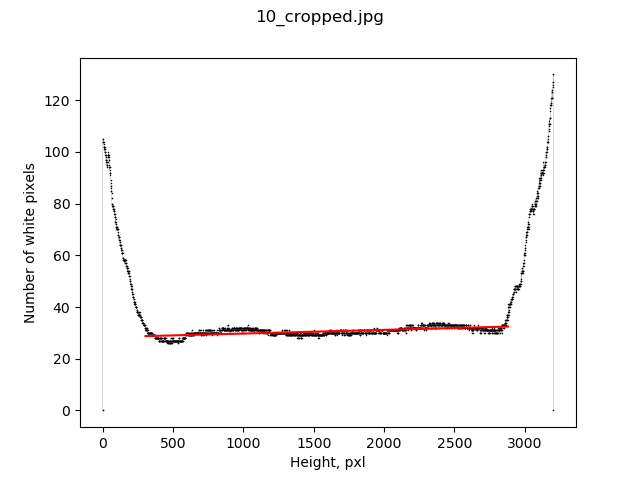
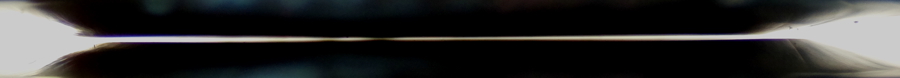

# *Report* 
### *About my internship in IJCLab (6th Sep 2021 - 6th Nov 2021)* 
## *Plunger adjustment*
#### *Kovalenko Ivan, 4th year, Taras Shevchenko National University of Kiev*
-----------------
### Table of Contents
1. [Problem](#problem)
2. [Image procesing](#Image)
    1. [Searching the slit](#Searching)
    2. [Converting image to black and white](#Converting)
    3. [Algorithm for finding the coordinates of the edges of the slit](#Algorithm)
    4. [Counting white pixels, plotting, fitting](#Counting)
    5. [Angle calculation](#Angle)

2. [Camera](#Camera)
    1. [Phone camera](#Phone)
    2. [RPi camera](#RPi)
    3. [Separation capacity](#Separation)
3. [Running the program](#Running)

### Problem 

The task was to find a way to set paralellism of Plunger foils. We chose an approach of using optics. 

The idea is to take photos of the slit between foils. Then one counts distance between foils (in pixels) and receives angle between foils (after calculations).  

### Image processing

#### Searching the slit
To find the slit on the image we use [OpenCV Template Matching](https://docs.opencv.org/3.4.13/de/da9/tutorial_template_matching.html). 
We apply the template picture of the slit and a picture, where we want to find a slit. The program returns rectangle where, "according to its calculations", slit is. You can see an example below (template-image with slit-result). 
&nbsp;&nbsp;&nbsp;&nbsp;&nbsp;&nbsp;&nbsp;&nbsp;&nbsp;&nbsp;&nbsp;
#### Converting image to black and white
To convert a picture to b&w format we import image using OpenCV library with flag "0":   
    cv2.imread("/path/to/image", **0**) , details [here](https://www.geeksforgeeks.org/python-opencv-cv2-imread-method/).

To avoid gradient of black color we use [OpenCV Thresholding](https://www.pyimagesearch.com/2021/04/28/opencv-thresholding-cv2-threshold/).

Here are examples of pictures with and without gradient.

&nbsp;&nbsp;&nbsp;&nbsp;&nbsp;&nbsp;&nbsp;&nbsp;&nbsp;&nbsp;&nbsp;&nbsp;&nbsp;&nbsp;&nbsp;&nbsp;&nbsp;&nbsp;&nbsp;&nbsp;&nbsp;&nbsp;&nbsp;&nbsp;&nbsp;&nbsp;&nbsp;&nbsp;&nbsp;&nbsp;&nbsp;&nbsp;&nbsp;&nbsp;&nbsp;&nbsp;&nbsp;&nbsp;&nbsp;&nbsp;&nbsp;&nbsp;&nbsp;&nbsp;&nbsp;&nbsp;&nbsp;&nbsp;&nbsp;&nbsp;&nbsp;&nbsp;&nbsp;&nbsp;&nbsp;&nbsp;&nbsp;&nbsp;&nbsp;&nbsp;&nbsp;&nbsp;&nbsp;&nbsp;&nbsp;&nbsp;&nbsp;&nbsp;&nbsp;&nbsp;&nbsp;&nbsp;&nbsp;&nbsp;

#### Algorithm for finding the coordinates of the edges of the slit
To find the bottom edge:

* count number of white  pixels at one-sixth of the height ( *l* );
* count number of white  pixels at every height (starting from the bottom) one by one ( *n* );
* if  ***n < l + sqrt(l)***, we say that ***n*** is the bottom edge.

For the top edge we do the same but starting from the top.
#### Counting white pixels, plotting, fitting
On this step we count white pixels at every height from the bottom edge to the top edge one by one, and plot this array in dependence on height. You can see an example below (nonlinear behavior of point graph is explained in [Camera paragraph](#Camera)).

&nbsp;&nbsp;&nbsp;&nbsp;&nbsp;&nbsp;&nbsp;&nbsp;

#### Angle calculation
It is obvios that the number of white pixels is proportionately to the distance between foils (it isn't exactly the distance because of optical distortions that produce widening of the slit). We can imagine that one of the foils is X-axis and another one is linear function (of course, it is an approximation, but it distorts result not a lot because angle between them is tiny). From fitting we get parameters *b* and *k* (because linear function is defined as *y=k&times;x+b*). Therefore, the angle &beta; we can find from next ratio: *&beta;=arctg(k)*.
Formula for error of mean: 

&nbsp;&nbsp;&nbsp;&nbsp;&nbsp;&nbsp;&nbsp;&nbsp;&nbsp;&nbsp;&nbsp;&nbsp;&nbsp;&nbsp;&nbsp;&nbsp;&nbsp;&nbsp;&nbsp;&nbsp;&nbsp;&nbsp;&nbsp;&nbsp;&nbsp;&nbsp;&nbsp;&nbsp;&nbsp;&nbsp;&nbsp;&nbsp;&nbsp;&nbsp;&nbsp;&nbsp;&nbsp;&nbsp;&nbsp;&nbsp;&nbsp;&nbsp;&nbsp;&nbsp;&nbsp;&nbsp;&nbsp;&nbsp;

### Camera
#### Phone camera
First experiments were made using phone camera (Redmi Note 8T). It gave good sharpness and tiny optical distortions, but low resolution because of lossy compresion (it's a part of built-in processing in most phones) and low quality of hardware.

#### RPi camera

Now we are using [Raspberry Pi High Quality Camera 12.3MP](https://www.raspberrypi.com/products/raspberry-pi-high-quality-camera/) with [telescope lens](https://thepihut.com/products/microscope-lens-for-raspberry-pi-high-quality-camera-module). The photomatrix is much better and can give much better resolution. The problem is that lens stongly blurs object that isn't in focus because of its parameters (small MOD (minimal object distance), open aperture and big magnification). The only one parameter we can change is aperture (for our lens it's constant, but we should consider this information if we buy another lens). 

At the moment things are so that if lens is focused on the nearest point of foils, the farthest is blurred a lot, and vice versa. You can see that on the example below edges of slit are in focus, whereas the nearest points are not.

&nbsp;&nbsp;&nbsp;&nbsp;&nbsp;&nbsp;&nbsp;&nbsp;&nbsp;&nbsp;

&nbsp;&nbsp;&nbsp;&nbsp;&nbsp;&nbsp;&nbsp;&nbsp;&nbsp;&nbsp;

To use Raspberry Pi Camera we need a built-in (into Raspberrian) package [raspistill](https://thepihut.com/blogs/raspberry-pi-roundup/raspberry-pi-camera-board-raspistill-command-list). Also I am to notice that to use camera most efficiently, we need to take vertical photos (in such a way that the slit occupies almost all the height). In that case we have pictures with horizontal slit as an output (raspistill can't rotate images correctly), so we should use [image_rotation.py](./image_procesing/image_rotation.py) to turn clockwise ninety degrees every image in selected set.

#### Separation capacity of RPi Camera
On the photo below you can see photo of ruller.

Distance between dashes of 12 and 13 cm is 2490 pixels (average quantity). Therefore, 

&nbsp;&nbsp;&nbsp;&nbsp;&nbsp;&nbsp;&nbsp;&nbsp;&nbsp;&nbsp;&nbsp;&nbsp;&nbsp;&nbsp;&nbsp;&nbsp;&nbsp;&nbsp;&nbsp;&nbsp;&nbsp;&nbsp;&nbsp;&nbsp;&nbsp;&nbsp;&nbsp;&nbsp;&nbsp;&nbsp;&nbsp;&nbsp;&nbsp;&nbsp;&nbsp;&nbsp;&nbsp;&nbsp;&nbsp;&nbsp;

But we have some tricky moment with the slit: because of Fraunhofer diffraction. Unfortunatelly, the distance is not directly proportional to the number of pixels. Here you can see graph of micrometers versus number of pixels (half logarithmic scale).

&nbsp;&nbsp;

It would be nice to consider this fact during calculation the angle, but currently we have no idea how to do it correctly.

### Running the program
>*For running this program you need to have packages with defined in [requirements.txt](requirements.txt) versions installed.*

To run all the program, run [main.py](./image_procesing/main.py). Than using *Source path* and *Template path* buttons select the files (template must be made by yourself by cropping one of source images). Than you can set the point from 0 to 255 (70 by default) wich will separate black and white pixels (for example if this point is 50, pixels with brightness >50 will be convert to totally white, others will be convert to totally black). After pushing *calculate button* and calculating, you will receive angles of each image, mean angle, error of mean, relative error of mean and maximal possible distance. 

&nbsp;&nbsp;&nbsp;&nbsp;&nbsp;&nbsp;&nbsp;&nbsp;&nbsp;&nbsp;&nbsp;&nbsp;&nbsp;&nbsp;&nbsp;&nbsp;&nbsp;&nbsp;&nbsp;&nbsp;

Maximal possible distance is maximal possible distance (in the plane of photo) between foils when we have electric contact. On the image below you can see the scheme: red poit is point of electrical contact, green lines are foils and blue one is *maximal possible distance*.

&nbsp;&nbsp;&nbsp;&nbsp;&nbsp;&nbsp;&nbsp;&nbsp;&nbsp;&nbsp;&nbsp;&nbsp;&nbsp;&nbsp;&nbsp;&nbsp;&nbsp;&nbsp;&nbsp;&nbsp;&nbsp;&nbsp;&nbsp;&nbsp;&nbsp;&nbsp;&nbsp;&nbsp;&nbsp;&nbsp;&nbsp;&nbsp;&nbsp;&nbsp;&nbsp;&nbsp;&nbsp;&nbsp;&nbsp;&nbsp;&nbsp;&nbsp;&nbsp;&nbsp;&nbsp;&nbsp;&nbsp;&nbsp;&nbsp;&nbsp;&nbsp;&nbsp;&nbsp;&nbsp;&nbsp;&nbsp;&nbsp;&nbsp;&nbsp;&nbsp;&nbsp;&nbsp;&nbsp;&nbsp;&nbsp;&nbsp;&nbsp;&nbsp;&nbsp;&nbsp;&nbsp;&nbsp;&nbsp;&nbsp;&nbsp;&nbsp;

>*All the \*.py files have description inside.*

### Conclusions
We have got the approach for measuring paralellism of foils of OUPS. And it undoubtedly can be used in the future.

Unfinished issues:

* correct consideration of optical distortions in calculations;
* focusing on all the points of foils in one time;
* taking photos from two mutually perpendicular directions (moving one camera or using two cameras).

